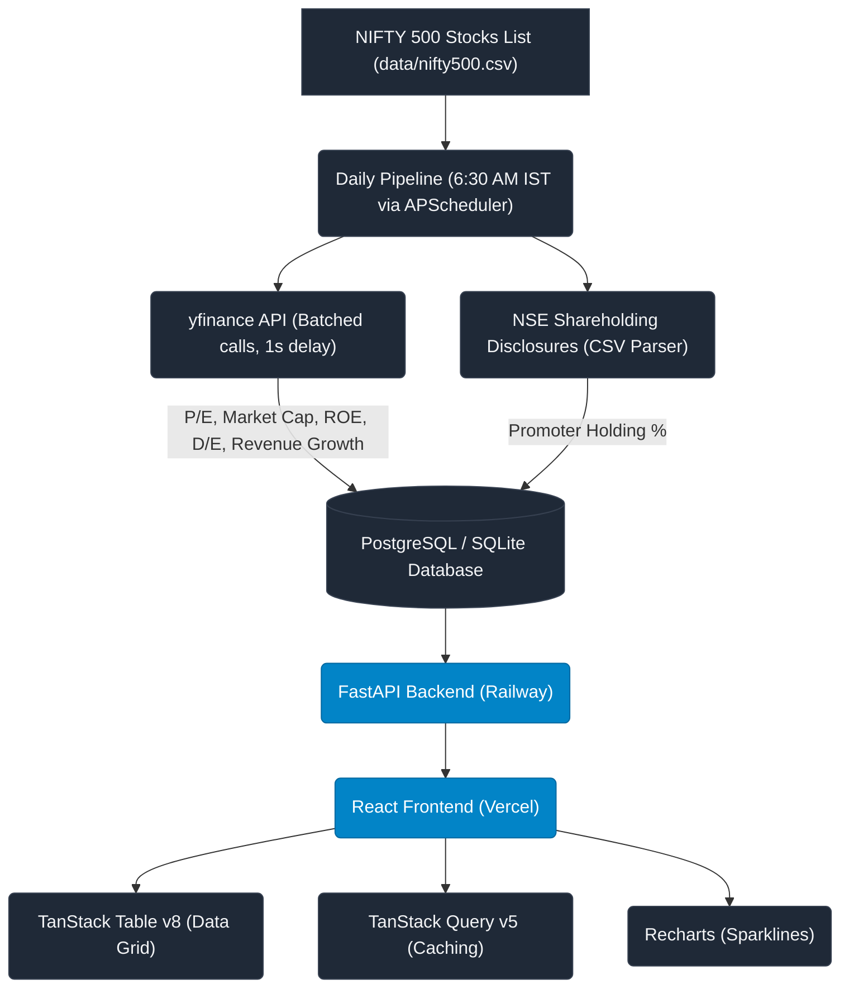

# 🚀 NSE Stock Screener

[](https://fastapi.tiangolo.com)
[](https://react.dev)
[](https://www.typescriptlang.org)
[](https://tailwindcss.com)
[](https://www.postgresql.org)
[](https://opensource.org/licenses/MIT)

A high-performance, visually stunning fundamental stock screener for India's NIFTY 500 stocks. Filter, sort, and analyze the market in real-time with sub-500ms response times. Positioned as a modern, clean, and ad-free alternative to Screener.in.

**Live Application → [nse-screener-rose.vercel.app](https://nse-screener-rose.vercel.app)**  
*Data updates automatically every morning at 6:30 AM IST.*

---

## 💡 Why I Built This

Every retail investor in India has used Screener.in at some point. It's the go-to tool for fundamental analysis, but it has some real pain points — the UI is dense and ad-heavy, complex filter combinations can be slow, and there's no quick way to compare sectors side by side.

I wanted to build something faster and cleaner. The core idea was simple: **pre-compute everything**. Instead of hitting `yfinance` on every user request (which would take 30+ seconds), a background pipeline runs at 6:30 AM IST every day, fetches data for all 500 stocks, and stores it in a database. Every API call just reads from that database — sub-second, always.

---

## ⚙️ Core Architecture

The most important design decision in this project is the strict separation between the **pipeline** and the **API**.



> [!IMPORTANT]
> **Performance Guarantee:** Any filter query — no matter how complex — is compiled into a single SQL `SELECT` statement with chained `WHERE` clauses. Since the database tables are pre-populated, API response times are consistently under **500ms**.

---

## ✨ Features

### 📊 Stock Screener Tab
* **Glassmorphic Filter Panel**: Slide filters seamlessly to narrow down stocks by P/E, ROE, Debt/Equity, YoY Revenue Growth, and Promoter Holding.
* **One-Click Presets**: Pre-configured filters for *High ROE*, *Low Debt*, *Growth Stocks*, *Value Picks*, and *Strong Promoters*.
* **Custom Presets**: Create, edit, and save your own filter combinations directly to browser local storage.
* **TanStack Data Grid**: Features fluid server-side sorting, pagination, and columns configuration.

### 📈 Stock Detail Modal
* **Sector Percentile Rankings**: Instantly see how a stock compares to its industry peers (e.g., *"This stock's ROE is higher than 84% of its sector peers"*).
* **Historical Trend Sparklines**: Visualize quarterly ROE and P/E trends using light, interactive Recharts sparklines.

### 🌐 Sector Overview Tab
* **Industry Performance Ranking**: Compare all NIFTY 500 sectors ranked by average P/E, ROE, and Debt/Equity.
* **Proportional Charts**: Dynamic visual bar charts to instantly spot high-quality or overleveraged sectors.

---

## 🛠️ Tech Stack

### Backend
| Tool | Rationale |
|---|---|
| **FastAPI** | Auto OpenAPI/Swagger documentation, native asynchronous support, Pydantic type safety. |
| **SQLAlchemy 2** | Type-safe ORM utilizing a composable query builder (filters chain as SQL `WHERE` clauses). |
| **APScheduler** | Async scheduler running inside the FastAPI process — no extra workers or Redis required. |
| **yfinance** | Light and reliable Yahoo Finance scraper to acquire stock market data. |
| **pytest + httpx** | 23 integration tests utilizing an in-memory SQLite database (no mocks). |

### Frontend
| Tool | Rationale |
|---|---|
| **React 18 + TS** | Industry-standard component framework with compile-time type safety. |
| **Vite** | Blazing-fast development build server and Hot Module Replacement (HMR). |
| **TanStack Table v8** | Headless table library enabling complete styling control with server-side sort/pagination hooks. |
| **TanStack Query v5** | Out-of-the-box caching, background synchronization, and loading transitions. |
| **Tailwind CSS** | Premium glassmorphism utility classes and responsive styling. |
| **Recharts** | Declarative charting library for rendering sparklines in the details layout. |

---

## 🖥️ Running Locally

### Prerequisites
* **Python 3.12+**
* **Node.js 18+**

### Step-by-Step Setup

1. **Clone the repository and install backend dependencies:**
   ```bash
   git clone https://github.com/Jenak26/nse-screener.git
   cd nse-screener
   pip install -r requirements.txt
   ```

2. **Configure environment variables:**
   ```bash
   cp .env.example .env
   # The default .env is pre-configured for SQLite local development
   ```

3. **Start the FastAPI backend server:**
   ```bash
   uvicorn backend.api.main:app --reload --port 8000
   ```

4. **Seed initial market data:**
   *(Note: Fetching data for all 500 stocks sequentially takes about 15 minutes due to yfinance API rate-limiting.)*
   ```bash
   curl -X POST http://localhost:8000/api/admin/run-pipeline
   ```

5. **Install and run the React frontend:**
   *(Open a new terminal)*
   ```bash
   cd frontend
   cp .env.example .env        # Configures VITE_API_URL=http://localhost:8000
   npm install
   npm run dev
   ```

Open **http://localhost:5173** to view the application.

---

## 📁 Project Structure

```
nse-screener/
├── backend/
│   ├── api/
│   │   ├── main.py              # FastAPI application & lifecycle startup
│   │   ├── schemas.py           # Pydantic models for request/response serialization
│   │   └── routes/
│   │       ├── stocks.py        # /stocks query endpoints
│   │       └── sectors.py       # /sectors averages and analytics
│   ├── database/
│   │   ├── models.py            # SQLAlchemy Schema definition (Stock, MetricHistory)
│   │   ├── db.py                # Engine settings and Session factory
│   │   └── queries.py           # SQL filter queries, percentile ranks, history helpers
│   ├── pipeline/
│   │   ├── fetcher.py           # yfinance scraper with batching & recovery
│   │   ├── nse_holdings.py      # NSE Shareholding CSV disclosure parser
│   │   └── scheduler.py         # Daily Scheduler & snapshots job
│   └── config/
│       └── settings.py          # pydantic-settings environment variables loader
├── frontend/
│   └── src/
│       ├── components/
│       │   ├── FilterPanel.tsx  # Dynamic sidebar filters
│       │   ├── StockTable.tsx   # TanStack Data Grid
│       │   ├── StockDetailModal.tsx  # Interactive detail modal
│       │   ├── SectorView.tsx   # Sector comparative charts
│       │   ├── PresetBar.tsx    # Saved filters quick switcher
│       │   └── Sparkline.tsx    # Recharts data-visualizer
│       ├── hooks/
│       │   └── useStocks.ts     # TanStack Query custom hooks
│       ├── lib/
│       │   └── api.ts           # Axios clients and API paths
│       ├── types/
│       │   └── stock.ts         # TypeScript schema types
│       └── App.tsx              # Component orchestration and tab states
├── data/
│   └── nifty500.csv             # Official list of 500 NIFTY symbols
├── tests/
│   ├── conftest.py              # Pytest fixtures and mock database setup
│   ├── test_api.py              # Route testing
│   └── test_queries.py          # Database queries validation
├── railway.toml                 # Railway production deploy settings
└── requirements.txt             # Backend dependencies
```

---

## 🚀 Deploying to Production

### 1. Backend & DB (Railway)
1. Fork this repository on GitHub.
2. Link your repository inside your Railway dashboard.
3. Provision a **PostgreSQL** instance in the same Railway project.
4. Set the following Environment Variables on the Backend Service:
   * `DATABASE_URL`: Retrieve the connection string from your PostgreSQL variables.
   * `CORS_ORIGINS`: Set to your local dev URL and production domain (e.g., `http://localhost:5173,https://your-app.vercel.app`).
   * `STOCK_UNIVERSE_PATH`: `data/nifty500.csv`
5. Generate a public Domain (Settings -> Networking).
6. Trigger the pipeline once using the `/api/admin/run-pipeline` endpoint to pre-seed the database.

### 2. Frontend (Vercel)
1. Import your forked repository on Vercel.
2. Set the root directory to `frontend`.
3. Add the following Environment Variable:
   * `VITE_API_URL`: Set to your backend's public domain URL.
4. Deploy the application.

---

## 🔑 License

Distributed under the MIT License. See `LICENSE` for more information.
